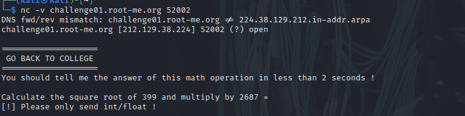

# ROOT-ME SCRIPTING:

**TCP - Retour au collège**

# TASK :

Pour commencer cette épreuve utilisant le protocole TCP, vous devez vous connecter à un programme sur une socket réseau.

Vous devez calculer la racine carrée du nombre n°1 et multiplier le résultat obtenu par le nombre n°2.
Vous devez ensuite arrondir à deux chiffres après la virgule le résultat obtenu.
Vous avez 2 secondes pour envoyer la bonne réponse à partir du moment où le programme vous envoie le calcul.

# Break-Down :

-Connexion socket réseau utilisant protocole TCP: 

nc domain-name port-number (-v : verbose pour regarder dedans la connexion bien précisement ce que fait nc et la réponse qu’il recoit)

- vous devez vous connecter à un programme:

connexion a un programme sur le port dédié:



le programme s’execute a la connexion et affiche le task:

Vous devez calculer la racine carrée du nombre n°1 et multiplier le résultat obtenu par le nombre n°2.

dans le programme donné: n1 = 399 et n2 = 2687

donc on doit retourné un résultat = sqr(399) * 2687 mais est ce que le task génére n1 et n2 aléatoirement a chaque execution? (on verra apres pourquoi cette question) =⇒ réexecution nc


oui effectivement.

Mais attention ! 

-Vous avez 2 secondes pour envoyer la bonne réponse à partir du moment où le programme vous envoie le calcul.

pour éliminer que vous trichiez avec une calculatrice on limite le temps de réponse pour s’assurer que ta réponse est absolument réalisé par un script donc calcul immédiat et réponse émidiate par votre ordinateur.

# Réalisation du script

1. **étape 1 : réaliser la connexion (petite recherche google et vous trouverez la librairie que vous en avez besoin):**

```python
import socket

HOST = "challenge01.root-me.org"  # The server's hostname or IP address
PORT = 52002  # The port used by the server

with socket.socket(socket.AF_INET, socket.SOCK_STREAM) as s:
    s.connect((HOST, PORT))
    data = s.recv(1024)

print(f"Received {data!r}")

```

Ce code nous rends ca:

```bash
$ python3 college.py 
Received b'\n====================\n GO BACK TO COLLEGE\n====================\nYou should tell me the answer of this math operation in less than 2 seconds !\n\nCalculate the square root of 470 and multiply by 4713 = '

```

donc data contient la chaine d’ou on doit extraire n1 et n2

```bash
 \n====================\n GO BACK TO COLLEGE\n====================\nYou should tell me the answer of this math operation in less than 2 seconds !\n\nCalculate the square root of 470 and multiply by 4713 = 
```

# script Finale:

```python
import socket
import math

HOST = "[challenge01.root-me.org](http://challenge01.root-me.org/)"  # The server's hostname or IP address
PORT = 52002  # The port used by the server

with socket.socket(socket.AF_INET, socket.SOCK_STREAM) as s:
	s.connect((HOST, PORT))
	data = s.recv(1024)
	print(data)
	
	numbers = [int(s) for s in data.split() if s.isdigit()]
	print(f"nombres extrait de la chaine : {numbers}")
	
	square_root = math.sqrt(numbers[1])  * numbers[2]
	print(f"apres calcul racine(n1) * n2 = {square_root}")
	
	rounded_number = round(square_root, 2)
	
	print(f"rounded number : {rounded_number}")
	
	s.sendall((str(rounded_number) ).encode())
	data = s.recv(1024)
	print(data)

```